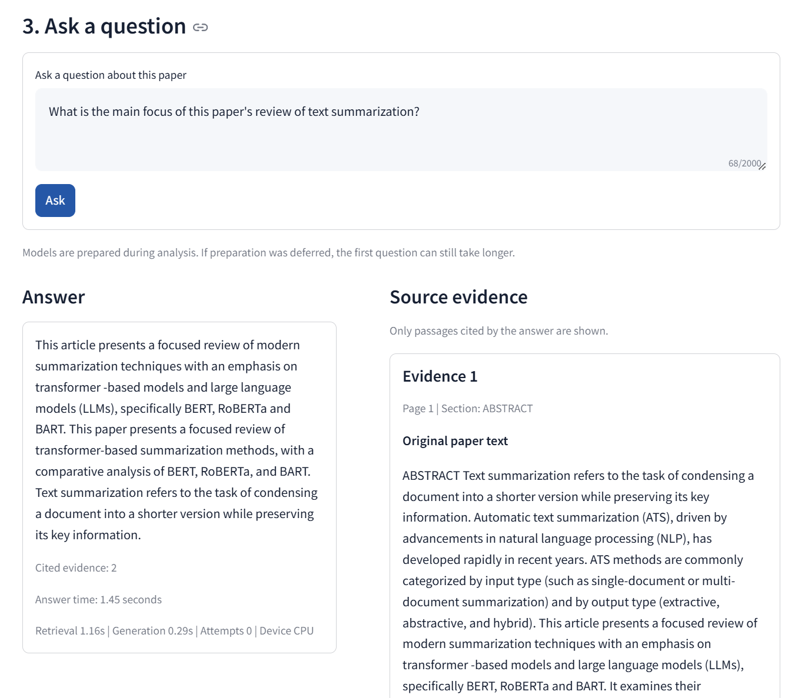
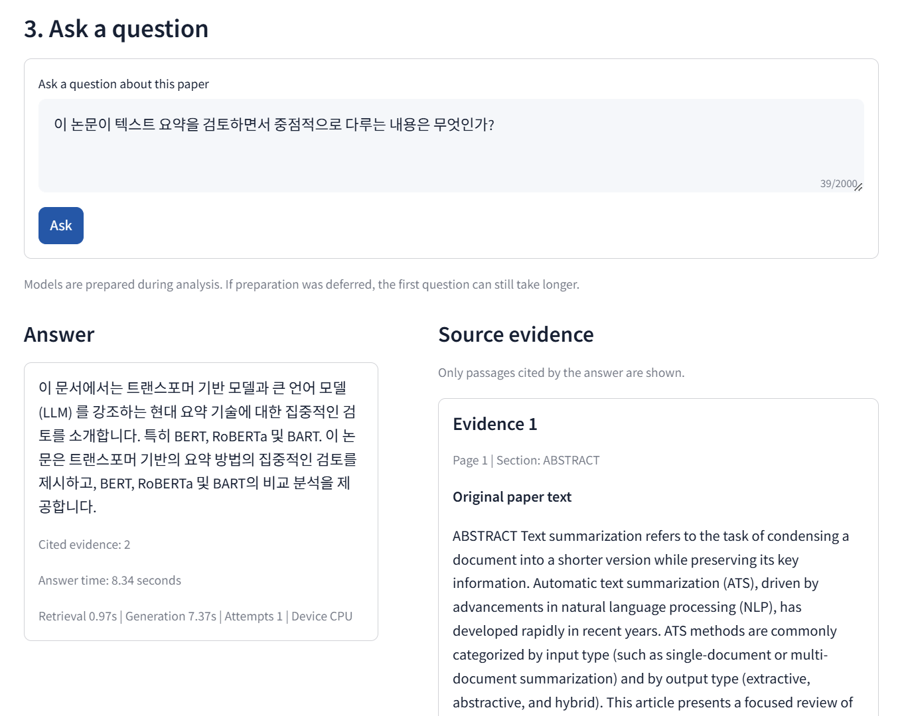
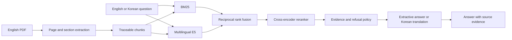

# Evidence-Grounded Paper Q&A

[English](README.md) | [한국어](README_KO.md)

Evidence-Grounded Paper Q&A is a local application for asking English or Korean questions about one text-based English research paper. Every supported answer is paired with the original sentence, page, section, and chunk identifier used as evidence.

## Demo

| English answer | Korean answer |
|---|---|
|  |  |

Additional screens: [PDF upload](docs/assets/screenshots/01-upload.png), [paper overview](docs/assets/screenshots/02-analysis-complete.png), and [Docker images](docs/assets/screenshots/docker.png).

## What it does

- Uploads one text-based English PDF up to 20 MiB
- Extracts pages, sections, an abstract, and traceable text chunks
- Retrieves evidence with BM25 and multilingual E5, then fuses and reranks candidates
- Answers in the language of the question
- Shows only cited evidence with page, section, original text, and chunk ID
- Refuses questions when the retrieved paper text is not sufficient
- Runs locally with FastAPI, Streamlit, and Docker Compose

## System



See [architecture](docs/architecture.md) for component responsibilities and trust boundaries.

## Evaluation

| Scope | Result |
|---|---:|
| Corpus robustness | 30 papers, 563 pages, 2,463 chunks |
| Verified retrieval benchmark | 40 questions on 10 papers, 20 EN and 20 KO |
| Recall@1 / Recall@3 | 0.300 / 0.850 |
| Recall@5 / Recall@10 | 1.000 / 1.000 |
| MRR overall / EN / KO | 0.5838 / 0.6308 / 0.5367 |
| Answerable retention / unsupported holdout refusal | 95% / 90% |
| Reviewed answers | 3 pass, 14 partial, 3 fail |
| Pass or partial | 85% |
| Citation support failures | 0 |
| Docker Q&A review | 4 pass, 6 partial, 0 fail |
| Docker API mean | EN 1.47 s, KO 11.95 s |

Retrieval accuracy is measured only on the first 10 papers. The other 20 papers are parser and runtime robustness cases without manually verified Gold evidence. Answer labels are assistant-led, not an independent human evaluation. Details and artifact links are in [evaluation](docs/evaluation.md).

## Run locally

Docker Desktop is required for the recommended path.

```bash
docker compose up --build -d
docker compose ps
```

- UI: `http://127.0.0.1:8501`
- API documentation: `http://127.0.0.1:8000/docs`
- Health check: `http://127.0.0.1:8000/health`

The first analysis can take several minutes while pinned models are downloaded. The UI waits up to 600 seconds. Model files and uploaded papers remain in named Docker volumes after a normal shutdown.

```bash
docker compose down
```

Do not add `--volumes` unless uploaded data and the model cache should also be removed. See [Docker setup](docs/deployment/docker.md) for configuration and troubleshooting.

## Verify

```bash
python -B scripts/verify_project.py
```

The verification command runs current regression tests and validates tracked data integrity, traceability, reviewed answers, Docker evidence, and the evaluation manifest. A public clone does not need private PDFs or generated model caches. When all 30 local PDFs and the dense cache are present, their additional source and corpus checks run automatically. The command does not download models or repeat long benchmarks.

## Repository structure

```text
app/            FastAPI endpoints, jobs, storage, and Q&A service
config/         pinned model and runtime configuration
data/           metadata, processed corpus, and final evaluation evidence
docs/           architecture, evaluation, data, and Docker documentation
scripts/        current ingestion, evaluation, and validation commands
tests/          product and regression tests
ui/             bilingual Streamlit interface
```

## Scope

This portfolio MVP excludes scanned PDFs and OCR, visual interpretation of tables or figures, reliable formula interpretation, multi-paper comparison, accounts, and public hosting. Raw PDFs and user uploads are excluded from Git unless redistribution is explicitly permitted.

## Documentation

- [Documentation index](docs/README.md)
- [Architecture](docs/architecture.md)
- [Evaluation](docs/evaluation.md)
- [Failure case analysis](docs/failure_cases.md)
- [Data and licensing](docs/data.md)
- [Docker setup](docs/deployment/docker.md)
