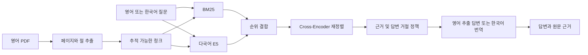

# Evidence-Grounded Paper Q&A

[English](README.md) | [한국어](README_KO.md)

Evidence-Grounded Paper Q&A는 텍스트 추출이 가능한 영어 논문 한 편에 대해 영어 또는 한국어로 질문하는 로컬 애플리케이션입니다. 답변에는 실제로 사용한 논문 원문, 페이지, 절과 청크 식별자가 함께 제공됩니다.

## 실행 화면

| 영어 답변 | 한국어 답변 |
|---|---|
|  |  |

추가 화면: [PDF 업로드](docs/assets/screenshots/01-upload.png), [논문 개요](docs/assets/screenshots/02-analysis-complete.png), [Docker 이미지](docs/assets/screenshots/docker.png).

## 주요 기능

- 최대 20 MiB의 텍스트 기반 영어 PDF 한 편 업로드
- 페이지, 절, 초록과 추적 가능한 텍스트 청크 추출
- BM25와 다국어 E5 검색 결과를 결합한 뒤 Cross-Encoder로 재정렬
- 질문 언어와 같은 언어로 답변
- 실제 인용한 근거의 페이지, 절, 원문과 청크 ID 표시
- 논문 근거가 부족한 질문은 명시적으로 답변 거절
- FastAPI, Streamlit과 Docker Compose 로컬 실행

## 시스템 구조



구성요소와 신뢰 경계는 [아키텍처 문서](docs/architecture_KO.md)에 정리했습니다.

## 평가 결과

| 범위 | 결과 |
|---|---:|
| 코퍼스 강건성 | 논문 30편, 563페이지, 2,463청크 |
| 검증 검색 벤치마크 | 논문 10편의 40문항, 영어 20 + 한국어 20 |
| Recall@1 / Recall@3 | 0.300 / 0.850 |
| Recall@5 / Recall@10 | 1.000 / 1.000 |
| 전체 / 영어 / 한국어 MRR | 0.5838 / 0.6308 / 0.5367 |
| 답변 가능 문항 유지 / 비근거 홀드아웃 거절 | 95% / 90% |
| 검토 답변 | 통과 3, 부분 통과 14, 실패 3 |
| 통과 또는 부분 통과 | 85% |
| 인용 지지 실패 | 0건 |
| Docker 질의응답 검토 | 통과 4, 부분 통과 6, 실패 0 |
| Docker API 평균 | 영어 1.47초, 한국어 11.95초 |

검색 정확도는 첫 10편에서만 측정했습니다. 추가 20편은 수동 Gold 근거가 없는 파서 및 실행 강건성 자료입니다. 답변 판정은 독립적인 사람 평가가 아닌 어시스턴트 주도 검토입니다. 자세한 범위와 산출물은 [평가 문서](docs/evaluation_KO.md)에 있습니다.

## 로컬 실행

권장 실행에는 Docker Desktop이 필요합니다.

```bash
docker compose up --build -d
docker compose ps
```

- UI: `http://127.0.0.1:8501`
- API 문서: `http://127.0.0.1:8000/docs`
- 상태 확인: `http://127.0.0.1:8000/health`

첫 분석은 고정 모델을 내려받는 동안 몇 분이 걸릴 수 있으며 UI는 최대 600초를 기다립니다. 일반 종료 후에도 모델과 업로드 자료는 Docker 볼륨에 남습니다.

```bash
docker compose down
```

업로드 자료와 모델 캐시까지 삭제할 때만 `--volumes`를 사용하세요. 설정과 문제 해결은 [Docker 실행 문서](docs/deployment/docker_KO.md)를 참고하세요.

## 검증

```bash
python -B scripts/verify_project.py
```

현재 회귀 테스트와 데이터 무결성, 원문 추적성, 검토 답변, Docker 증거와 최종 평가 매니페스트를 검증합니다. 모델을 내려받거나 긴 벤치마크를 반복하지 않습니다.

## 저장소 구조

```text
app/            FastAPI 엔드포인트, 작업, 저장소와 질의응답 서비스
config/         고정 모델과 실행 설정
data/           메타데이터, 처리 코퍼스와 최종 평가 자료
docs/           아키텍처, 평가, 데이터와 Docker 문서
scripts/        현재 사용하는 수집, 평가와 검증 명령
tests/          제품 및 회귀 테스트
ui/             한영 Streamlit 화면
```

## 범위

이 포트폴리오 MVP는 스캔 PDF와 OCR, 표·그림의 시각적 해석, 신뢰할 수 있는 수식 해석, 여러 논문 비교, 계정과 공개 배포를 제외합니다. 재배포가 명시적으로 허용되지 않은 원본 PDF와 사용자 업로드는 Git에 포함하지 않습니다.

## 문서

- [문서 안내](docs/README_KO.md)
- [아키텍처](docs/architecture_KO.md)
- [평가](docs/evaluation_KO.md)
- [데이터와 라이선스](docs/data_KO.md)
- [Docker 실행](docs/deployment/docker_KO.md)
