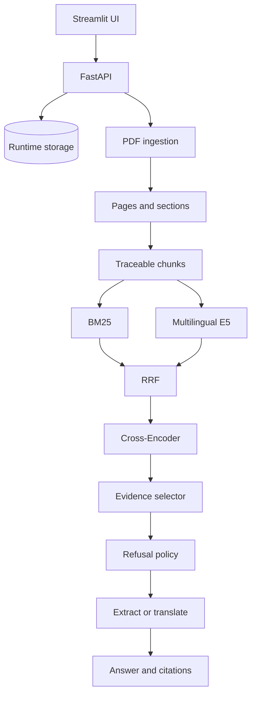

# Architecture

[English](architecture.md) | [한국어](architecture_KO.md)

## Request flow

1. The FastAPI backend validates and stores one text-based English PDF.
2. The ingestion pipeline extracts page text, detects sections, and creates chunks that preserve `paper_id`, page, section, and `chunk_id`.
3. BM25 and multilingual E5 independently retrieve candidates from the selected paper.
4. Reciprocal rank fusion combines both rankings. A Cross-Encoder reranks the 20-candidate pool.
5. The evidence selector returns up to five diverse, traceable passages.
6. A deterministic relevance policy may refuse the question before generation.
7. English answers are composed extractively. Korean answers translate selected evidence with the pinned local NLLB model.
8. Citations are assembled from selected evidence, not invented by the answer model.

## Why this design

- Sparse retrieval remains strong for exact English terminology.
- Multilingual dense retrieval reduces vocabulary mismatch for Korean questions over English papers.
- Reranking improves ordering after broad candidate recall.
- Page and chunk identifiers remain attached throughout the pipeline, making each citation auditable.
- Generation cannot choose arbitrary citation identifiers; the service attaches citations from the selected source sentences.

## Runtime boundary

The application processes one uploaded paper at a time. Runtime uploads and per-paper indexes are private and excluded from Git. The portfolio corpus is used for evaluation and is not copied into Docker images. Models are pretrained and revision-pinned; this project does not fine-tune them.
