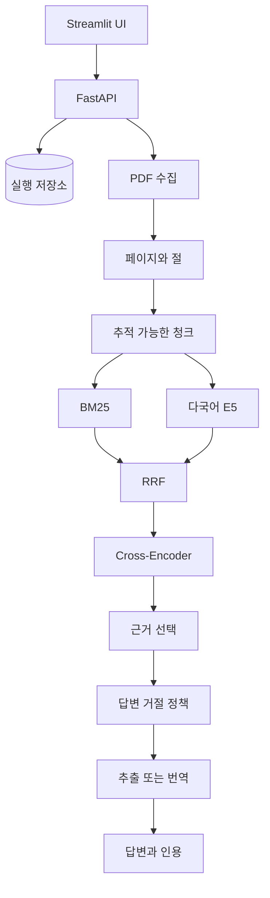

# 아키텍처

[English](architecture.md) | [한국어](architecture_KO.md)

## 요청 흐름

1. FastAPI 백엔드가 텍스트 기반 영어 PDF 한 편을 검증하고 저장합니다.
2. 수집 파이프라인이 페이지 텍스트와 절을 추출하고 `paper_id`, 페이지, 절과 `chunk_id`를 보존한 청크를 만듭니다.
3. BM25와 다국어 E5가 선택한 논문에서 각각 후보를 검색합니다.
4. Reciprocal Rank Fusion으로 두 순위를 합친 뒤 Cross-Encoder가 20개 후보를 재정렬합니다.
5. 근거 선택기가 중복을 줄인 추적 가능한 근거를 최대 5개 반환합니다.
6. 결정론적 관련도 정책이 생성 전에 답변을 거절할 수 있습니다.
7. 영어 답변은 근거 문장을 추출해 구성하고, 한국어 답변은 고정된 로컬 NLLB 모델로 선택 근거를 번역합니다.
8. 인용은 답변 모델이 만들지 않고 선택된 원문 근거에서 결정론적으로 조립합니다.

## 설계 이유

- Sparse 검색은 정확한 영어 전문 용어에 강합니다.
- 다국어 Dense 검색은 한국어 질문과 영어 논문 사이의 단어 불일치를 줄입니다.
- 재정렬은 넓게 확보한 후보의 최종 순위를 개선합니다.
- 페이지와 청크 식별자를 전 과정에서 유지하므로 인용을 원문까지 추적할 수 있습니다.
- 생성 모델은 임의의 인용 ID를 선택할 수 없고, 서비스가 선택된 원문 문장에서 인용을 붙입니다.

## 실행 범위

애플리케이션은 업로드한 논문 한 편을 처리합니다. 업로드 자료와 논문별 인덱스는 비공개이며 Git에서 제외합니다. 포트폴리오 코퍼스는 평가에만 사용하고 Docker 이미지에 복사하지 않습니다. 사전학습 모델의 리비전을 고정해 사용하며 별도 미세조정은 하지 않습니다.
